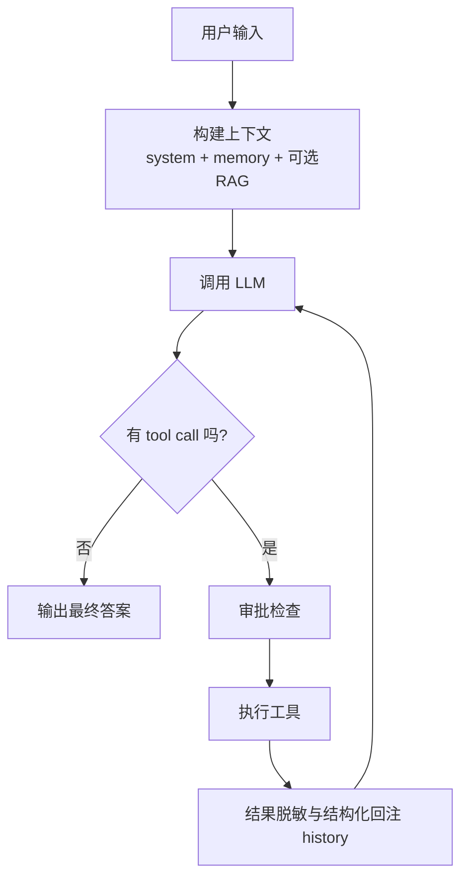

# ZeroClaw 核心介绍：Agent Loop

> 一句话概括：`Agent Loop` 是 ZeroClaw 的执行中枢，负责把“用户输入 -> 模型推理 -> 工具调用 -> 结果回注 -> 最终回复”串成可控闭环。

---

## 阅读导航

- 前置阅读：`01-project-overview.md`、`02-deployment-guide.md`
- 建议后续：`05-provider-trait.md`、`06-channel-trait.md`、`07-tool-trait.md`、`08-memory-trait.md`

---

## 1. 为什么 Agent Loop 是核心

在 ZeroClaw 架构里，Provider/Tool/Memory/Channel 都是可替换模块，但真正把它们编排起来的是 `src/agent/loop_.rs`。

它做的不是“单次模型调用”，而是“迭代式决策执行”：

- 先让模型思考
- 若需要，调用工具
- 将工具结果反馈给模型继续思考
- 直到产出可返回的最终答案

这正是 Agent 与普通 ChatBot 的本质区别。

---

## 2. 关键入口函数

`src/agent/loop_.rs` 里有两个最关键的函数：

- `run(...)`：初始化运行环境，处理 CLI 单轮/交互模式
- `run_tool_call_loop(...)`：执行“模型-工具”迭代闭环

其中 `run_tool_call_loop(...)` 的定位非常清晰（源码注释）：

```rust
/// Execute a single turn of the agent loop: send messages, parse tool calls,
/// execute tools, and loop until the LLM produces a final text response.
pub(crate) async fn run_tool_call_loop(...)
```

---

## 3. Agent Loop 的主流程

可以把一次完整 turn 理解为下面 7 步：

1. **构建上下文**：系统提示词 + 记忆召回 +（可选）硬件文档上下文
2. **请求模型**：调用 provider（支持 native tool calls 或文本协议）
3. **解析工具调用**：从响应中提取 `tool_calls` 或 `<tool_call>` 块
4. **执行工具**：按名称查找工具并执行
5. **结果脱敏回注**：把 `<tool_result>` 或 `role: tool` 写回 history
6. **继续下一轮迭代**：模型基于结果再次推理
7. **收敛返回**：无工具调用时，输出最终文本答案

---

## 4. 执行循环的“安全阀”

为了避免失控循环，源码设置了硬限制：

```rust
const MAX_TOOL_ITERATIONS: usize = 10;
```

超过上限会直接失败返回：

```rust
anyhow::bail!("Agent exceeded maximum tool iterations ({MAX_TOOL_ITERATIONS})")
```

这属于典型的 fail-fast 保护。

---

## 5. 工具调用协议：双通道兼容

ZeroClaw 同时兼容两类工具调用模式：

### 5.1 Native tool call（优先）

当 provider 支持原生工具调用时，走结构化 `tool_calls`，并保留 `tool_call_id`，便于标准化 tool message 回传。

### 5.2 Prompt-based tool call（兜底）

当 provider 不支持原生调用时，解析文本中的工具标签：

- `<tool_call>...</tool_call>`
- `<toolcall>...</toolcall>`
- `<tool-call>...</tool-call>`
- 以及 markdown fence 变体（` ```tool_call `）

这套兼容层让不同模型接入时更稳健。

---

## 6. 审批与监督：Approval Hook

在 `run_tool_call_loop(...)` 内，工具执行前有审批钩子：

- 若工具命中审批策略，触发 `ApprovalManager`
- CLI 渠道会交互确认
- 非 CLI 渠道默认自动通过（按当前实现）

这体现了 ZeroClaw 的“可监督自治”设计。

---

## 7. 记忆在 Loop 中的作用

`run(...)` 中每个 turn 前后都会和 Memory 交互：

- **前置召回**：`build_context(mem, user_msg)` 注入相关记忆
- **后置沉淀**：`auto_save` 开启时保存用户输入与回复摘要

所以 Agent Loop 不是无状态推理，而是“带记忆的迭代推理”。

---

## 8. 交互模式 vs 单次消息模式

`run(...)` 支持两种执行形态：

- **单次消息**（`zeroclaw agent -m "..."`）：执行一轮并退出
- **交互模式**（`zeroclaw agent`）：保留 `history` 持续多轮

交互模式额外支持：

- `/help`、`/quit`
- `/clear`：清理对话历史并尝试删除会话记忆（conversation/daily）

---

## 9. 一张图看懂 Agent Loop



---

## 10. 设计价值总结

`Agent Loop` 的价值不在“调用了多少模型”，而在于它把执行系统做成了一个可控闭环：

- **可扩展**：工具、记忆、provider 都可替换
- **可治理**：审批、脱敏、迭代上限、观察事件
- **可持续**：通过 memory 自动沉淀上下文
- **可兼容**：原生/提示词工具调用双路径

这就是 ZeroClaw 作为“Agent Runtime”而不是“LLM Wrapper”的核心所在。

---

## 11. 建议连读源码

- `src/agent/loop_.rs`（主循环）
- `src/tools/traits.rs`（工具契约）
- `src/memory/traits.rs`（记忆契约）
- `src/providers/traits.rs`（模型契约）
- `src/approval/mod.rs`（审批机制）
