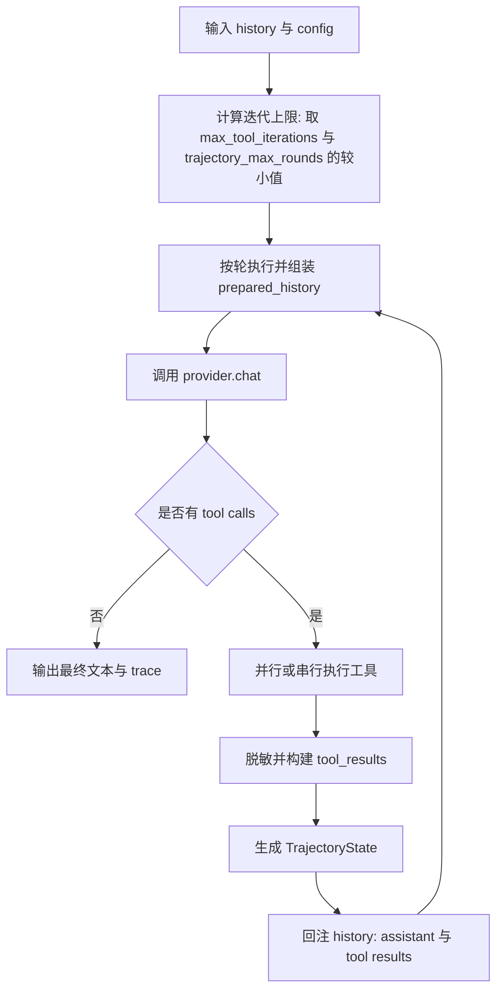

# `src/agent/loop_.rs` 程序设计结构说明

> 目标：从工程结构角度解释 `loop_.rs` 如何把 **Provider / Tool / Memory / Security / Channel** 组织成一个可控的 Agent 执行内核。

---

## 1. 文件定位与职责边界

`src/agent/loop_.rs` 是 ZeroClaw 的执行编排中心，承担三层职责：

- **执行内核**：模型请求、工具调用、结果回注、迭代收敛。
- **运行入口**：CLI 模式（单轮/交互）与通道消息处理（`process_message*`）。
- **治理能力**：审批门控、脱敏、历史压缩、轨迹状态、可观测追踪。

它不直接实现具体 Provider/Tool/Memory，而是依赖 trait 与工厂产物，保持架构解耦。

---

## 2. 结构分层（按模块意图）

可把本文件划分为 6 个层次：

1. **基础工具层**
   - 凭据脱敏：`scrub_credentials`
   - 历史裁剪/压缩：`trim_history`、`auto_compact_history`
   - 记忆与硬件上下文拼装：`build_context`、`build_hardware_context`

2. **工具调用解析层**
   - 统一解析入口：`parse_tool_calls`
   - 兼容多协议：
     - OpenAI 风格 `tool_calls` JSON
     - XML 标签（`<tool_call>`/`<toolcall>`/`<tool-call>`/`<invoke>`）
     - Markdown fence `tool_call`
     - GLM 风格调用别名与参数

3. **轨迹与追踪模型层**
   - `TrajectoryState`
   - `AgentStepTrace` / `AgentTrace`
   - `ToolLoopOutput` / `ProcessMessageOutput`

4. **工具执行层**
   - 单工具执行：`execute_one_tool`
   - 并行判定：`should_execute_tools_in_parallel`
   - 并发/串行执行：`execute_tools_parallel`、`execute_tools_sequential`

5. **核心循环层**
   - 兼容包装：`run_tool_call_loop`
   - 完整实现：`run_tool_call_loop_with_trace`

6. **应用入口层**
   - CLI 入口：`run`
   - API/网关入口：`process_message_with_trace`、`process_message`

---

## 3. 核心数据结构

- `ParsedToolCall`
  - 内部统一的工具调用表示（`name + arguments`）。
- `TrajectoryState`
  - 每轮压缩出的结构化状态：`objective / evidence / uncertainties / failures / next_plan / tool_calls`。
- `AgentStepTrace`
  - 两类事件：`LlmRequest` 与 `ToolCall`，记录成功性、耗时、错误、输出预览。
- `AgentTrace`
  - 单次请求全链路追踪：步骤、总耗时、迭代次数、轨迹状态数组。
- `ToolExecutionRecord`
  - 工具执行中间态（输出、耗时、成功、错误）用于回注与构建 trace。

这些结构使“运行结果”不再只是字符串，而是可评测、可观测、可复盘的数据对象。

---

## 4. 主执行链路（`run_tool_call_loop_with_trace`）

关键点：

- 迭代上限由 `max_tool_iterations` 与 `trajectory_max_rounds` 双约束共同决定。
- 若开启轨迹压缩，上一轮 `TrajectoryState` 会作为系统消息注入下一轮上下文。
- 支持 native tool-calling（结构化）与 prompt tool-calling（文本解析）双路径。
- 终止条件：
  - 无工具调用（成功收敛）
  - 超过迭代上限（fail-fast）
  - `CancellationToken` 触发（外部中断）

---

## 5. RE-TRAC-lite 在本文件的落点

轨迹压缩并不是独立子系统，而是直接嵌入主循环：

- **状态提炼**：`build_trajectory_state` 从“本轮文本 + 工具调用 + 工具结果”提炼结构化状态。
- **状态注入**：`trajectory_state_prompt_block` 把上一轮状态注入下一轮 system message。
- **状态输出**：`AgentTrace.trajectory_states` 对外返回（网关/UI 可直接消费）。

这使模型在多轮工具探索中具备“上一轮摘要记忆”，降低盲目重复和长尾失败。

---

## 6. 并发与审批策略

工具执行不是一刀切并行：

- `tool_calls <= 1`：不并行。
- 若存在审批要求（`ApprovalManager.needs_approval`）：强制串行，保证审批语义一致。
- 否则并行执行（`join_all`）提升 wall-clock 性能。

串行路径里：

- CLI 可触发交互审批；
- 非 CLI 对需要审批的调用默认拒绝（记录 `Denied by user`），避免静默越权。

---

## 7. 安全与稳态设计

`loop_.rs` 内部有多重“稳态保护”：

- **凭据脱敏**：工具输出先过 `scrub_credentials`，避免泄露 token/key/password。
- **能力校验**：有图像 marker 但 provider 不支持 vision 时立即报错。
- **历史控长**：
  - 软策略：`auto_compact_history`（总结旧对话）
  - 硬策略：`trim_history`（硬裁剪上限）
- **超限终止**：迭代超上限直接 `bail!`。
- **可取消**：模型请求与工具执行都尊重 `CancellationToken`。

---

## 8. 入口模式差异：`run` vs `process_message_with_trace`

- `run`
  - 面向 CLI，包含交互循环、`/help`、`/clear`、自动压缩、回显输出。
  - 管理“长会话 history”与会话记忆清理。

- `process_message_with_trace`
  - 面向网关/通道的一次性处理，返回 `ProcessMessageOutput { response, trace }`。
  - 更适合 API 响应、评测采集、前端 Trace Inspector 展示。

---

## 9. 可测试性设计

文件内置了较完整测试，覆盖：

- 凭据脱敏正确性
- 多模态能力约束（支持/不支持 vision）
- 工具并行执行与结果顺序稳定性
- 多种工具调用语法解析（JSON/XML/Fence/GLM）
- 取消与错误语义

这保证了高复杂度循环在重构时仍有回归护栏。

---

## 10. 目前结构特点与后续演进建议

当前 `loop_.rs` 的优势：

- 功能集中，跨模块编排路径清晰；
- 兼容面宽（native + prompt tool-calling）；
- 可观测信息完整（trace + trajectory）。

可预期的后续演进（保持 KISS 前提下）：

- 将“工具调用解析器”下沉为独立模块（降低主文件复杂度）。
- 将“CLI 交互逻辑”和“纯执行内核”进一步隔离，缩短核心循环阅读路径。
- 对 `TrajectoryState` 引入更细粒度质量信号（例如重复调用惩罚标签）供后续策略调优。

---

## 11. 一句话总结

`loop_.rs` 本质上是 ZeroClaw 的“执行操作系统内核”：  
它用统一循环把模型决策、工具执行、状态压缩与安全治理耦合为一个可控闭环，并通过 trace 把内部过程暴露为可评测资产。

